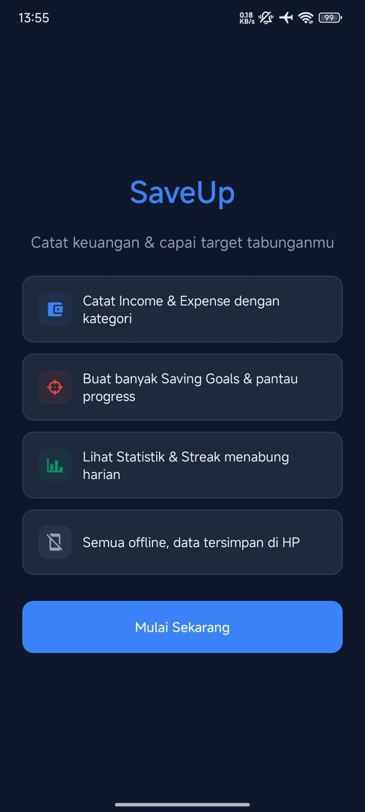
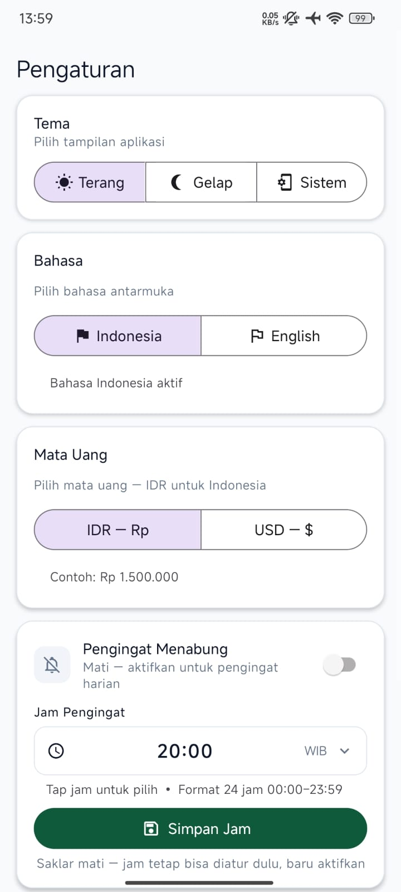
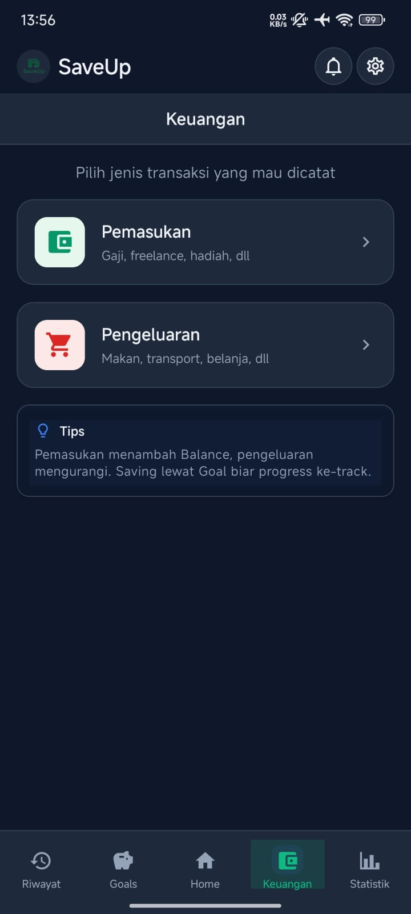
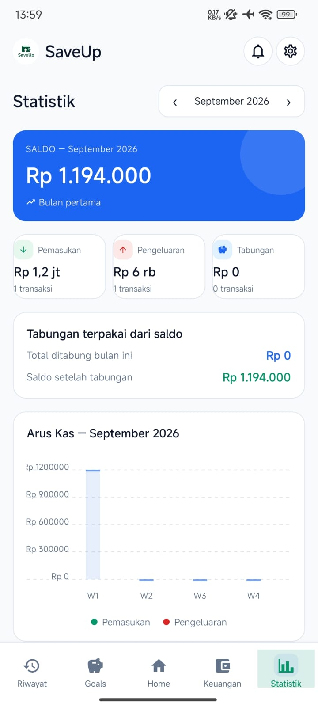
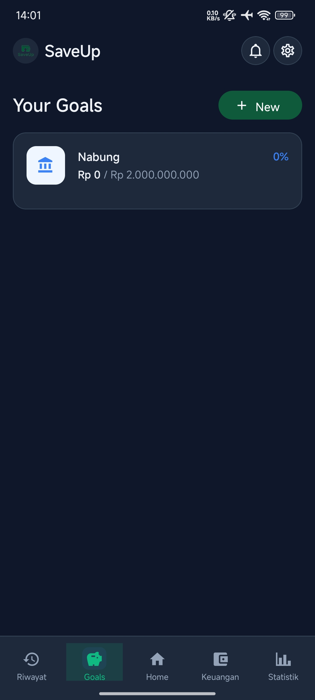
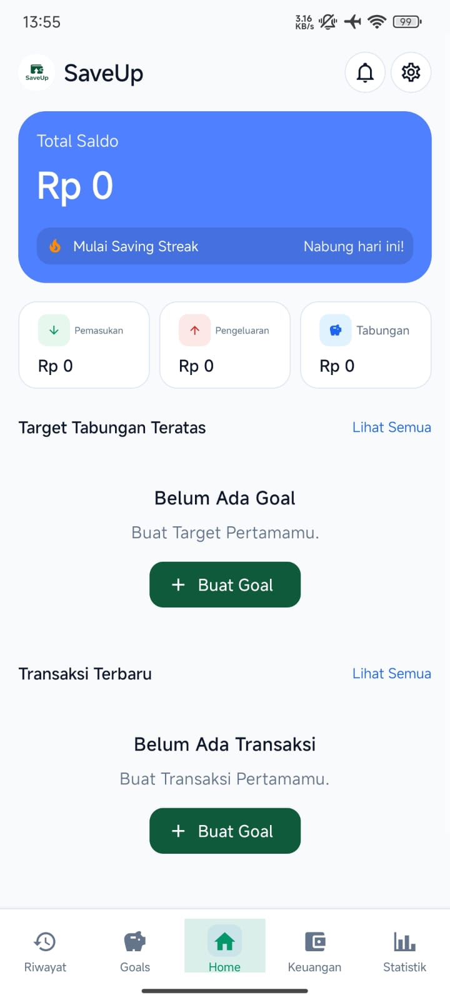

# SaveUp 💰

<p align="center">
  
</p>

<p align="center">
  <strong>Personal Finance & Saving App</strong>
</p>

<p align="center">
  Aplikasi mobile untuk membantu pengguna mengatur keuangan dan membangun kebiasaan menabung dalam satu aplikasi.
</p>

> 🚧 Project ini masih dalam tahap pengembangan.

---

## 📱 Download

Versi APK terbaru dapat diunduh melalui MediaFire:

<p align="center">
  <a href="https://www.mediafire.com/file/xicqc3100j53qvh/SaveUp.apk/file">
    <strong>⬇️ Download SaveUp APK</strong>
  </a>
</p>

> Saat ini SaveUp ditujukan untuk perangkat Android.

---

## ✨ Fitur

### 🏠 Dashboard

- Melihat total saldo
- Ringkasan pemasukan dan pengeluaran
- Melihat progress target tabungan
- Quick action untuk menambah pemasukan dan pengeluaran
- Melihat transaksi terbaru

### 🎯 Saving Goals

- Membuat beberapa target tabungan
- Menentukan nominal target
- Melihat progress tabungan
- Menambahkan dana ke target tabungan
- Melakukan penarikan dari tabungan

### 💰 Keuangan

- Mencatat pemasukan
- Mencatat pengeluaran
- Mengedit transaksi
- Menghapus transaksi
- Melihat daftar pemasukan dan pengeluaran
- Filter berdasarkan jenis transaksi

### 📋 Riwayat

- Melihat seluruh aktivitas keuangan
- Pemasukan
- Pengeluaran
- Menabung
- Penarikan tabungan

### 📊 Statistik

- Ringkasan kondisi keuangan
- Perbandingan pemasukan dan pengeluaran
- Progress target tabungan
- Visualisasi data keuangan

### 🔥 Saving Streak

- Membangun kebiasaan menabung
- Menampilkan streak menabung
- Memberikan motivasi agar konsisten

---

## 🖼️ Screenshots

### 01 — Onboarding

<p align="center">
  
</p>

### 02 — Pengaturan

<p align="center">
  
</p>

### 03 — Keuangan

<p align="center">
  
</p>

### 04 — Statistik

<p align="center">
  
</p>

### 05 — Saving Goals

<p align="center">
  
</p>

### 06 — Dashboard

<p align="center">
  
</p>

---

## 🛠️ Tech Stack

- **React Native**
- **Expo**
- **Expo Router**
- **TypeScript**
- **JavaScript**
- **Android**

---

## 🎨 Design

SaveUp menggunakan desain yang:

- Minimalis
- Clean
- Modern
- Mudah digunakan
- Fokus pada informasi keuangan
- Menggunakan warna utama `#0E5A3A`

Logo dan asset aplikasi menggunakan satu identitas visual yang konsisten di seluruh aplikasi.

---

## 🗂️ Struktur Navigasi

SaveUp menggunakan bottom navigation:

```text
┌──────────┬────────┬──────────┬──────────┬───────────┐
│  Riwayat │ Goals  │   Home   │ Keuangan │ Statistik │
└──────────┴────────┴──────────┴──────────┴───────────┘
```
